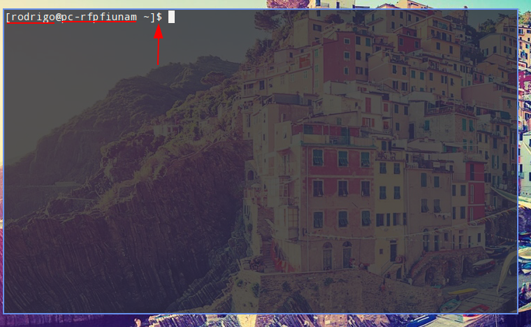
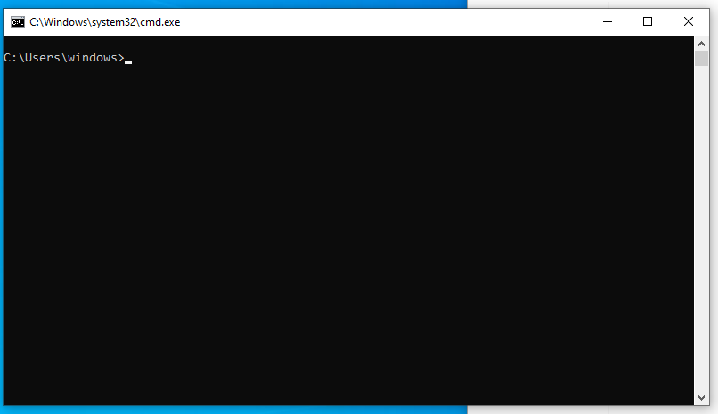
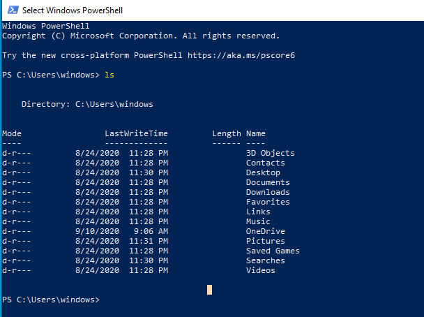
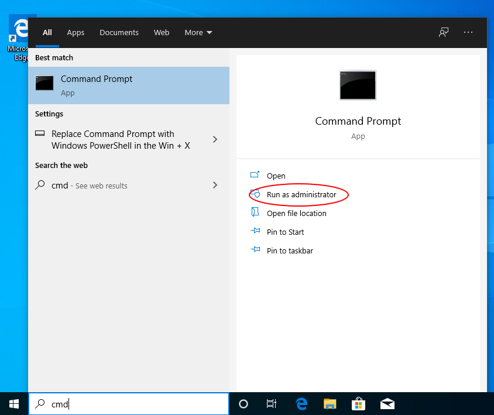
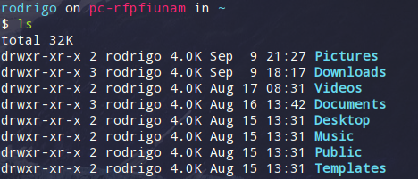
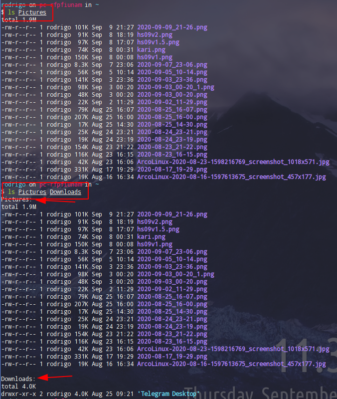
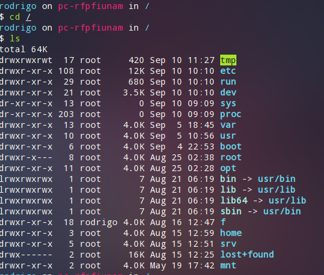
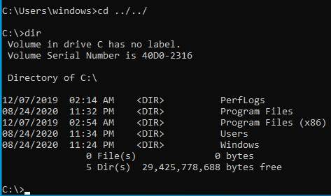
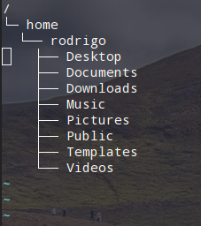

## Línea de comandos

En cualquier sistema operativo (GNU/Linux, MacOS o Windows) siempre tenemos acceso a una terminal (también conocida con consola o interfaz de línea de comandos), la cual resulta muy útil a la hora de:

* Iniciar o administrar servicios o procesos de background
* Administrar archivos
* Administrar espacio de disco duro, particiones o dispositivos externos.

Por ello todo mundo debería saber cómo moverse a través de este ente de software.

Todas las terminales en una interfaz gráfica se consideran como emuladores, una terminal real sería aquella en donde el sistema operativo no tenga una interfaz y solo nos podamos comunicar con la computadora por medio de comandos.

Existen alternativos de emuladores de terminal.

* MacOS cuenta con su terminal por defecto pero se puede instalar **iTerm2**, **Alacritty**, entre otros.
* Window cuenta con el famoso **CMD**, actualmente algunos prefieren **Powershell**, e inclusive de manera muy limitada se puede utilizar la consola de **git**.
* GNU/Linux ofrece infinitas posibilidades, cada entorno de escritorio tiene su propia terminal personalizada, por ejemplo **Gnome Terminal**, **Konsole**, **Deepin-Terminal**, y obviamente existen otras más que no tienen que ver con el entorno de escritorio como: **Alacritty**, **Termite**, **URVT**, etc.

Abrir un emulador de terminal depende del sistema operativo en el que nos encontremos e inclusive para GNU/Linux depende de la distribución de Linux en la que nos encontremos (Debian, Fedora, openSUSE, Arch, etc.)

* En general lo que debemos hacer es ir a nuestro menú de aplicaciones de buscar por la palabra "terminal" o "consola". 
* En GNU/Linux algunos entornos de escritorio tienen definido el atajo `Ctrl + Alt + t` para abrir una terminal.

Al abrir una terminal nos encontraremos con una interfaz como la que se observa en la imagen de abajo



### Prompt

De la imagen observamos que a la izquierda del cursor (la ínea que  titilea) aparece aparecen cierta información, a esto se le llama prompt.

La información que aparece en el *prompt* puede variar de terminal en terminal, por ejemplo en CMD de Window solo aparece la ruta en donde la terminal se abrió.

De la imagen de arriba, la información que tenemos es:

* Nombre de usuario

* Nombre de la computadora (Sirve para cuestiones de redes de computadoras)

* El signo de dólar (`$`) es útil para saber que estamos en un usuario común (sin privilegios)

  * Un usuario con privilegios (root) tiene un `#`, como se aprecia en la imagen

    

Para windows únicamente se despliega la ruta en dónde se encuentra la terminal 



También se puede usar *powershell* pero el nombre de los comandos podría variar:



En window para abrir una terminal con privilegios debemos hacerlo desde el menú Windows, click derecho en el programa y utilizar la opción de *Ejecutar como administrador*



### Shell

El concepto de *shell* se emplea solo en Windows y macOS, por lo que no se profundizará en esta guía. Sin embargo entenderlo es importante si se quiere personalizar complementamente el entorno de trabajo vía terminal.

Una shell provee de una interfaz de comunicación entre el usuario y el sistema operativo, nos permite ejecutar programas de la computadora o inclusive scripts creados por nosotros mismos.

Las *shells* más populares son: bash, zsh y fish, pero existen una infinidad. Por defecto los emuladores de terminal de Linux y MacOS suelen tener bash. Para comprobarlo es posible ejecutar lo siguiente: `echo $SHELL`.

### Comandos básicos en una terminal

#### Listar contenido de directorio

Cuando abrimos una terminal, esta se abre en un directorio, ¿Cuál es?

* Para sistemas Unix se abre en el famoso *home*
  * Para GNU/Linux es siempre `/home/nombreDeUsuario`
  * Para MacOS es `/Users/nombreDeUsuario`
* Para windows se abre de la misma manera en el directorio "home", aunque no se le suele conocer así, pero en ese directorio es donde están las carpetas de *Escritorio, Documentos, Videos, etc.* 
  * La ruta en donde se abre una terminal en windows es `C:\Users/nombreDeUsuario` 

Para listar el contenido de un directorio en sistemas Unix, en la terminal de Git (de windows) y en powerShell se puede ejecutar lo siguiente

```sh
ls
```

`ls` significa *list*, es decir, listar los directorios y archivos del directorio actual.



También es posible listar el contenido de una carpeta que se encuentre en el directorio actual

```sh
ls Pictures
```

Para ello ejecutamos `ls` seguido del nombre o nombres de carpetas que queramos saber que contienen (Otro ejemplo sería `ls Pictures Downlaods`)



Para el caso de CMD utilizamos el comando `dir`

#### Cambio de directorio

Para cambiarse de directorio en sistemas Unix, basta con ejecutar `cd` seguido del nombre del directorio al que nos queremos cambiar, por ejemplo:

```sh
cd Pictures
```

#### Estrucutura de directorios

Para sistemas Unix existe un directorio "principal" o "global" que contiene todos nuestros archivos. Se le suele conocer cómo *root*. y se representa con una diagonal `/`

Veamos que archivos tiene mi directorio *root*



El directorio equivalente en Windows es `C:`, que corresponde a la partición en donde esta instalado el sistema operativo. veamos que contiene 



Cabe recalcar que el directorio *root* es la raíz de todos los directorios, nada lo contiene a él. Esto es, un directorio siempre esta contenido en un directorio, excepto el directorio *root*.

Veamos donde esta nuestro directorio *home* de manera gráfica



#### Rutas absolutas y relativas

**El directorio padre** de cualquier directorio o carpeta es aquel que lo contiene.

Por ejemplo el direcotrio padre de *home* es *root*, el directorio padre de *Documents* es *rodrigo* y así sucesivamente.

Si estamos en la carpeta *Pictures*, ¿cómo accedemos a la carpeta padre? Para ello hacemos uso del concepto de **rutas relativas**.

*Las rutas relativas* funcionan con base en la carpeta en donde nos encontremos.

Para cambiarnos a la carpeta padre se puede usar `cd ../`

* Los dos punto (`..`) hacen referencia a la ruta padre
* Un punto (`.`) hace referencia al directorio actual.

Con ejercicio se recomienda ejecutar `ls .` y ` ls ..`

Cada carpeta contiene estas dos referencias (un punto y dos puntos).

Se puede utiliza varias veces el comando dos puntos. Cómo se sigue en el ejemplo:

```sh
f #<--- Queremos llegar aquí
├── campos
├── cursos
│   ├── curso_git #<------ Estamos aquí
│   │   ├── BIBLIOGRAFIA.md
│   │   ├── CONTRIBUTING.md
│   │   ├── img
│   │   ├── README.md
│   │   └── temas
```

**Solución**

```sh
cd ../../
```

Ahora, ¿si queremos pasarno a la carpeta de nombre *campos*?

**Solución**

```sh
cd ../../campos
```

Por otra parte, en las rutas **absolutas**  se utiliza la "ruta completa", desde la raíz hasta el directorio al que queremos ejecutar `ls` o `cd`.

Utilizando los ejemplos anteriores: 

```sh
ls /f/cursos/curso_git
# Cuando la forma abreviada es simplemente
ls 
# ó
ls .
```

Para cambiarse a otro directorio tendríamos que usar

```sh
cd /f/cursos
# ó
cd /f
```

Cómo se observa, el concepto de directorio padre es irrelevante para las rutas absolutas.

Se recomienda evitar el uso de rutas absolutas.

El único caso para donde se suelen usar es para configuraciones del sistema.

### Extras

**Para windows**

* Copiar un archivo
  * `copy <nombreArchivo> <destino>`
  * Ejemplo. Copiar el archivo `hola.c` a la carpeta padre `copy hola.c ../`
* Mover un archivo
  * `move <nombreArchivo> <destino>`
* Crear un directorio
  * `mkdir nombreDirectorio`

**Para Linux**

* Copiar un archivo
  * `cp <nombreArchivo> <destino>`
* Mover un archivo 
  * `mv <nombreArchivo> <destino>` 
* Crear un directorio
  * `mkdir nombreDirectorio`

