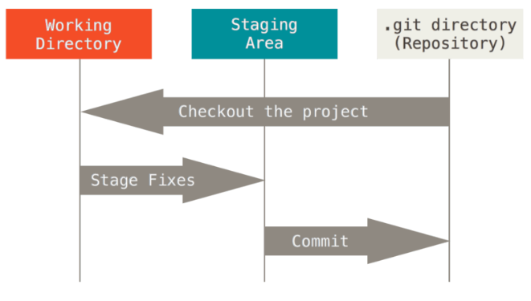

## ¿Qué es git?

Git es un software de control de versiones diseñado por Linus Torvalds.  Su propósito es llevar registro de los cambios en archivos de computadora y coordinar el trabajo que varias personas realizan sobre archivos compartidos.

Sus características principales son

* Velocidad
* Diseño simple
* Fuerte apoyo para el desarrollo no lineal (miles de ramas paralelas)
* Completamente distribuido
* Capaz de manejar proyectos grandes como el kernel de Linux de manera eficiente (velocidad y tamaño de datos)
* **Copias locales:** La mayoría de las operaciones en Git sólo necesitan archivos y recursos locales para funcionar. Por lo general no se necesita información de ningún otro computador de tu red. 
  * Puedes confirmar tus cambios felizmente hasta que consigas una conexión de red para subirlos. 
* **Integridad:** Todo  en  Git  es  verificado  mediante  una  suma  de  comprobación  (checksum  en  inglés)  antes  de  ser almacenado, y es identificado a partir de ese momento mediante dicha suma. Esto significa que es imposible  cambiar  los  contenidos  de  cualquier  archivo  o  directorio  sin  que  Git  lo  sepa. 
  * El mecanismo que usa Git para generar esta suma de comprobación se conoce como hash SHA-1
    * Se trata de una cadena de 40 caracteres hexadecimales (0-9 y a-f ), y se calcula en base a los contenidos del archivo o estructura del directorio. 
  * Si los archivos  no  se  han  modificado  Git  no  almacena  el  archivo  de  nuevo
    - Un  enlace  al  archivo anterior  idéntico  que  ya  tiene  almacenado.  

### Breve historia de git

### Arquitectura de git

 Git  maneja  sus  datos  como  un  **conjunto  de copias  instantáneas**  de  un  **sistema  de  archivos  miniatura**.  Cada  vez  que  confirmas  un  cambio,  o guardas  el  estado  de  tu  proyecto  en  Git,  él  básicamente  toma  una  foto  del  aspecto  de  todos  tus archivos en ese momento, y guarda una referencia a esa copia instantánea. 

Git  tiene  tres  estados  principales  en  los que   se   pueden   encontrar   tus   archivos:  

* **Confirmado   (committed)**: Significa que los datos están almacenados de manera segura en tu

  base  de  datos  local.

* **Modificado   (modified):** Significa  que  has  modificado  el  archivo  pero  todavía  no  lo  has

  confirmado  a  tu  base  de  datos

* **Preparado (staged):**  Preparado  significa  que  has  marcado  un  archivo  modificado  en  su versión actual para que vaya en tu próxima confirmación.



Esto nos lleva a las tres secciones principales de un proyecto en Git.

* **El directorio de Git (Git directory):** Aquí se almacenan los metadatos y la base de datos de objetos del proyecto.

* **El directorio de trabajo (working directory):** Es una copia de una versión del proyecto

* **El área de preparación (staging area o index):** generalmente contenido en tu directorio de Gi, almacena información acerca de lo que va a ir en tu próxima confirmación

### Configuración inicial de git

Git trae una herramienta llamada `git config` que te permite obtener y establecer variables de
configuración que controlan el aspecto y funcionamiento de Git. Estas variables pueden almacenarse en tres sitios distintos:

1. Archivo `/etc/gitconfig`: Contiene valores para todos los usuarios del sistema y todos sus
    repositorios. Si pasas la opción `--system` a `git config`, lee y escribe específicamente en este
    archivo.

2. Archivo `~/.gitconfig` o `~/.config/git/config`: Este archivo es específico a tu usuario. Puedes hacer que Git lea y escriba específicamente en este archivo pasando la opción `--global`.

3. Archivo config en el *directorio de Git* (es decir, `.git/config`) del repositorio que estés utilizando actualmente: Este archivo es específico al repositorio actual.
Cada nivel sobrescribe los valores del nivel anterior, por lo que los valores de `.git/config` tienen preferencia sobre los de `/etc/gitconfig`.

Puede hacer que git lea y escriba la configuración del directorio git usando la opción `--local`

**Creando la configuración estándar** 

Lo primero es establecer tu nombre de usuario y dirección de correo electrónico. 

* Esto es importante porque los "commits" de Git usan esta información, y es introducida de manera inmutable en los commits que envías.
* Solo necesitas hacer esto una vez si especificas la opción `--global`

```shell
git config --global user.name "NombreDeUsuario"
git config --global user.email nombreUsuario@example.com
```

Otra opcion común es configurar un editor de textos, por defecto se utiliza Vim, para elegir un editor de textos se utiliza el siguiente comando.

```shell
git configur --global core.editor nano	
```

Para comprobar la configuración se puede usar el comando `git config --list`

También puedes comprobar qué valor que Git utilizará para una clave específica ejecutando `git config <key>` :

```shell
git config user.name
```

#### Ayuda

Hay tres maneras de obtener ayuda para cualquier comando.

```shell
git help <verb>
git <verb> --help
man git-<verb>
```

Por ejemplo `git help config`

Se abrirá una página del manual o también conocida como *manpage*, muy famosas en GNU/Linux.

### Obtener un repositorio de git

Puedes obtener un proyecto Git de dos maneras. 

* La primera es tomar un proyecto o directorio existente e importarlo en Git. 
* La segunda es clonar un repositorio existente en Git desde otro servidor.

